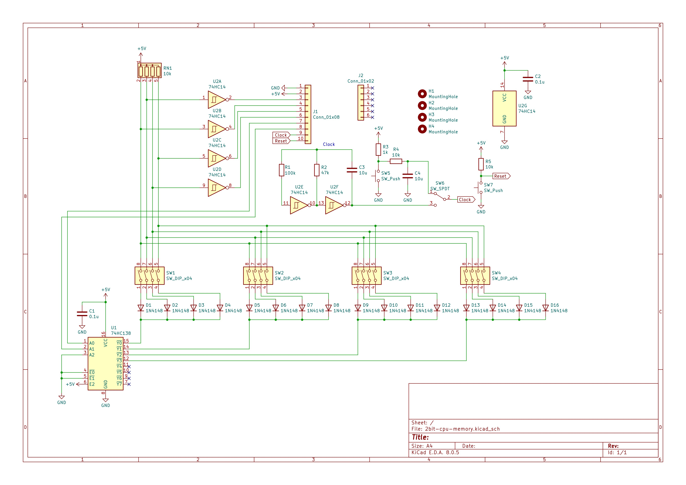

# 2bit CPU 組み立てキット

## 概要
11個のロジックICを使用した2bit CPUの組み立てキットです。

1bit CPUの進化版です。1bit CPUより部品点数が多くなっています。

入出力ポートを備えており、条件分岐するプログラムも書くことができます。非常に限られた機能しかありませんが、CPUの学習用として最適です。

電源はUSB Type-C端子です。ACアダプタ、ケーブルは付属しておりませんので別途ご用意ください。また、PowerDelivery等の給電には対応しておりませんのでご注意ください。

## 購入
この製品は以下のサイトから購入できます。  
[スイッチサイエンス - 2bit CPU 組み立てキット](https://www.switch-science.com/products/9955 "2bit CPU 組み立てキット")

#### お問い合わせフォーム
[製品に関するお問い合わせ](https://forms.gle/Fn5E3byABXJ8P5sbA)


## 使用方法
ROM書き込みはDIPスイッチを切り替えることで可能です。

DIPスイッチは上側がONです。プログラムでLEDのの点灯動作が変わります。トグルスイッチで1Hzのクロックか、マニュアルクロックかを切り替えできます。青色のボタンがマニュアルクロックです。赤色のリセットボタンを押すとリセットできます。

## スペック
<table>
  <thead>
    <tr>
      <th>項目</th>
      <th>スペック</th>
    </tr>
  </thead>
  <tbody>
    <tr>
        <td>汎用レジスタ</td>
        <td>2bit x 1</td>
    </tr>
    <tr>
        <td>アドレス空間</td>
        <td>4bit</td>
    </tr>
    <tr>
        <td>アドレスバス幅</td>
        <td>2bit</td>
    </tr>
    <tr>
        <td>ROM容量</td>
        <td>16bit</td>
    </tr>
    <tr>
        <td>命令セット</td>
        <td>ADD, IN, OUT, JNC</td>
    </tr>
    <tr>
        <td>プログラムカウンタ</td>
        <td>2bit</td>
    </tr>
    <tr>
        <td>フラグレジスタ</td>
        <td>キャリーフラグ×1</td>
    </tr>
    <tr>
        <td>算術演算</td>
        <td>2bitの加算</td>
    </tr>
    <tr>
        <td>クロック周波数</td>
        <td>約1Hz</td>
    </tr>
    <tr>
        <td>IC総数</td>
        <td>11個</td>
    </tr>
  </tbody>
</table>

## 命令セット
<table>
  <thead>
    <tr>
      <th>命令</th>
      <th>機械語</th>
      <th>説明</th>
    </tr>
  </thead>
  <tbody>
    <tr>
        <td>ADD A, Im</td>
        <td>00</td>
        <td>AレジスタにIm（イミディエイトデータ）を加算する。<br>実行後、キャリー発生時にCフラグを1にする。</td>
    </tr>
    <tr>
        <td>IN A</td>
        <td>01</td>
        <td>入力ポートのデータをAレジスタに転送する。<br>実行後、Cフラグを0にする。</td>
    </tr>
    <tr>
        <td>OUT Im</td>
        <td>10</td>
        <td>Imを出力ポートに転送する。<br>実行後、Cフラグを0にする。</td>
    </tr>
    <tr>
        <td>JNC Im</td>
        <td>11</td>
        <td>Cフラグが0のとき、Imで示された番地へジャンプする。<br>Cフラグが1のときは何もしない。実行後、Cフラグを0にする。</td>
    </tr>
  </tbody>
</table>

## プログラム例
#### 出力ポートをON/OFFさせるプログラム（Lチカ）
ニモニック
```text:
OUT 00
OUT 00
OUT 11
JNC 00
```

DIPスイッチ
```text:
ON  OFF OFF OFF
ON  OFF OFF OFF
ON  OFF ON  ON
ON  ON  OFF OFF
```

#### 入力ポートのどちらかがHIGHになると出力ポートをONにするプログラム
ニモニック
```text:
IN A
ADD A, 11
JNC 00
OUT 11
```

DIPスイッチ
```text:
OFF ON  OFF OFF
OFF OFF ON  ON
ON  ON  OFF OFF
ON  OFF ON  ON
```

#### 13秒タイマー
ニモニック
```text:
ADD A, 00
ADD A, 01
JNC 00
OUT 11
```

DIPスイッチ
```text:
OFF OFF OFF OFF
OFF OFF OFF ON
ON  ON  OFF OFF
ON  OFF ON  ON
```

## 回路図
[](./img/schematic01.jpg)
[](./img/schematic02.jpg)
[](./img/schematic03.jpg)

## 実装図
[](./img/implementation-diagram01.jpg)
[](./img/implementation-diagram02.jpg)

## 実装例
[](./img/implementation-example01.jpg)
[](./img/implementation-example02.jpg)
